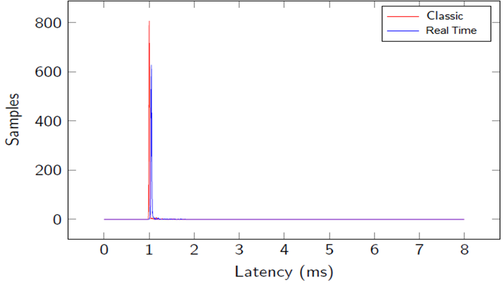
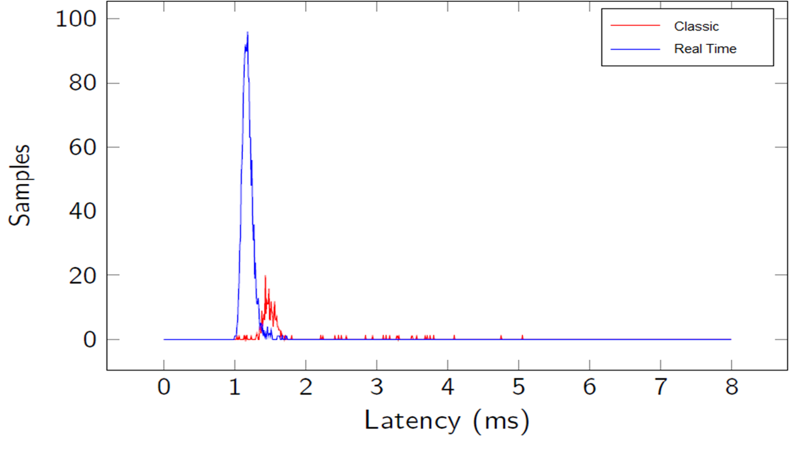

# Delay-aware-V2X-communication
### Prerequisites

```
 Linux 
 Patching your kernel to support IEEE802.11p (patch file is available in the resource directory)
 Having appropriate hardware supporting 5.9GHZ frequency  
```
### Installing

```
git clone https://github.com/chedi97/delay-aware-V2X-communication.git
```
### Compilation

```
make all
```
### Execution 

```
sudo ./setup
sudo ./client [options]
sudo ./ server
```
### Options 

```
-s [NUM] --packet_size            set the packet size to be sent and received
-a       --main_affinity= N       run main thread on processor #N
	                    	  sending thread will run on the same processor if -b is not specified	                          
-b       --thread_affinity= N     run sending thread on precessor #N
-y POLI  --policy= POLI           policy of realtime thread, POLI may be fifo(default) or rr
                                  format: --policy=fifo(default) or --policy=rr
-p PRIO  --priority= PRIO         set priority of program's thread
-c       --cycle = CYC            set number of maximum cycle 'CYC'           
-t       --period= PER            set period duration in ms
                                  default period is 10 ms 
-r       --run_time= RUN          set run_time duration in ms
-h	 --histogram        	  display histogram
-h HIS   --histogram=HIS     	  set HIS to 1 to display CDF histogram
```
### Some results 

## Latency with no stress



## Latency with stress




